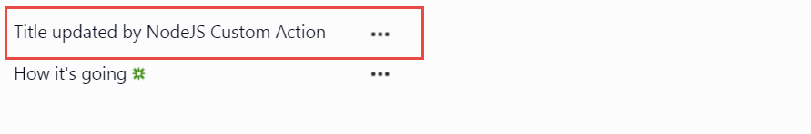

# O365-CustomAction-NodeJS
Build SharePoint Custom Item Context Menu Action using nodeJs
##Make this sample work
1. Get Secure password text file using the below PowerShell Command
 <code>Read-Host "Enter Password" -AsSecureString |  ConvertFrom-SecureString | Out-File "securePassword.txt"</code> 
when asked to enter passowrd enter your O365 user account password, the user should have premission to create custom action on the host web
2. Save the secure password text file to this repo root
3. Update O365Constants.js with client_id and client_secret for app_only app to get a pair navigate to https://{yourdomain}.sharepoint.com/_layouts/15/AppRegNew.aspx 
make usre that the generated credentials will have update list item permission
4. replace your actual subdomain in O365Constants.js
5. run  <code>npm install</code> 
6. create azure website or use ngrok to test using your local machine
7. link azure website to your forked github repo 
8. run deploy.ps1 to deploy the custom item context menu action and push new changes to your repo which will eventually trigger new azure website deployment
9. Make Sure you have PnP-PowerShell installed.

*script parameters*:
    1. userName : Your Office365 User
    2. SecurePasswordFile : Path to your generated password file
    3. WebUrl :Target Host Web to configure custom action
    4. ExternalUrl: Your azure public url+ '/item/' to use the custom express middleware
    5. ActionName : Custom Action Name
    6. ActionTitle : Custom Action Title
    7. Action Desc: Custom Action Desc 
**example**
 <code>.\deploy.ps1 -userName amrfouad@inisghtme.onmicrosoft.com -SecurePasswordFile .\securePassword.txt -WebUrl https://insightme.sharepoint.com -ExternalUrl https://o365-customaction.azurewebsites.net/item/ -ActionName UpdateTitle -ActionTitle "Update My Title" -ActionDesc "desc" -Verbose</code> 

Try it out it works on Custom lists only and it updates the OTB title to "Title updated by NodeJS Custom Action"
